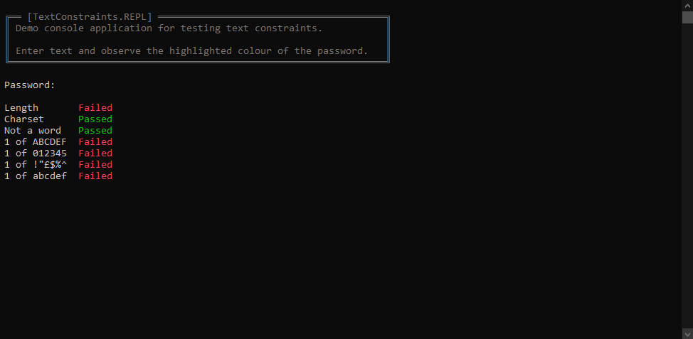
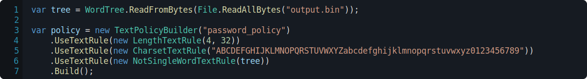
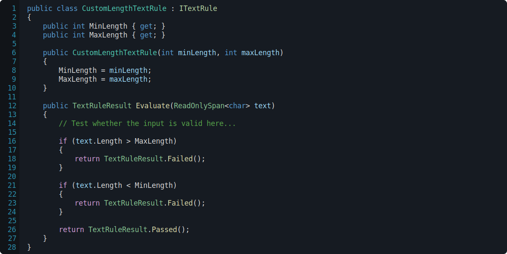
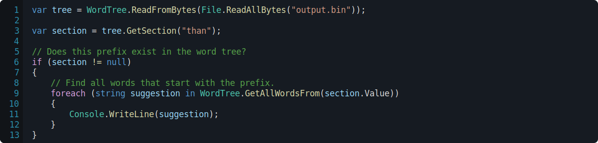
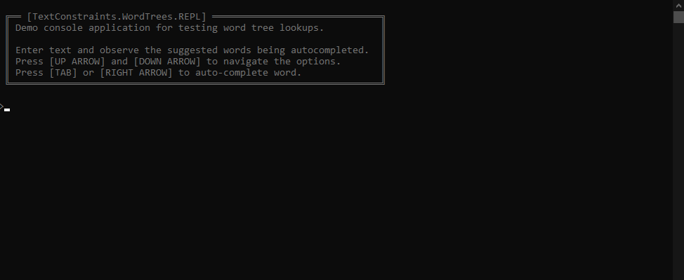

# 🔓 TextConstraints

**TextConstraints** is a few simple libraries for producing policies with regard to passwords and text validation written in **C#**.

<p align="center">
  
  <sup><i>A command-line password policy validator.</i></sup>
</p>

## ⚖ Text Policies

Password policies are constructed using a fluent interface.

<p align="center">
  
  <sup><i>A sample password policy.</i></sup>
</p>

Password policies can be extended with arbitrary rules to create more complex password policies that enforce more requirements.

<p align="center">
  
  <sup><i>Creating a more complex password policy.</i></sup>
</p>

Password policies can be evaluated quite simply, with a result object which can be evaluated to determine which rules passed and failed within the policy.

<p align="center">
  
  <sup><i>Evaluating text against a policy.</i></sup>
</p>

### 🧪 Creating custom rules

Custom rules can be created by implementing the `ITextRule` interface.

<p align="center">
  
  <sup><i>A custom <code>ITextRule</code> implementation.</i></sup>
</p>

Rules can then be added to a policy like any other rule.

<p align="center">
  
  <sup><i>Using a custom text rule in a policy.</i></sup>
</p>

## 🌲 Word Trees

A word tree is a compact mechanism used to store dictionaries for quick lookups.

This project serilies word trees in a binary format, via the following specificiation

```txt
[0..-1] = TreeNode[] : An array of all nodes contained within the tree.

Structure: TreeNode (3 bytes)
  [0..0] = char : The character this node represents. 
  [1..2] = ushort : The amount of proceeding nodes that should be considered a child node of this one. +32768 if the node represents a full word.
```

All words in the Oxford English Dictionary [found here](https://raw.githubusercontent.com/sujithps/Dictionary/master/Oxford%20English%20Dictionary.txt) in this tree format compresses down to ~372 KB. This may be quite larger than expected; but this is a **search-optimized data structure**. Other encodings like Huffman encoding on comma-seperated values will optimize for size more efficiantly.

Once loaded, a word tree can be quickly scanned to see whether a word is contained within a tree; and also list all elements in the tree past a given node.

<p align="center">
  
  <sup><i>Finding suggestions in a word tree.</i></sup>
</p>

This feature to be able to find words using a given prefix is how a lot of auto-complete tools can be implemented. Below is a console demo of this.

<p align="center">
  
  <sup><i>A command-line demonstration of word auto-completion.</i></sup>
</p>

> ⚠ *This implementation of word trees cannot handle **a single root** letter containing more than **32,768 words**.*

> ⚠ *This implementation of word trees only affords for a single ASCII byte for characters. **Unicode is not supported**.*

To address the issues highlighted above; the data-structure can be increased in size.

## 📝 License

This work is licensed under a [Creative Commons Attribution-NonCommercial 4.0 International License](http://creativecommons.org/licenses/by-nc/4.0/).

[](http://creativecommons.org/licenses/by-nc/4.0/)
